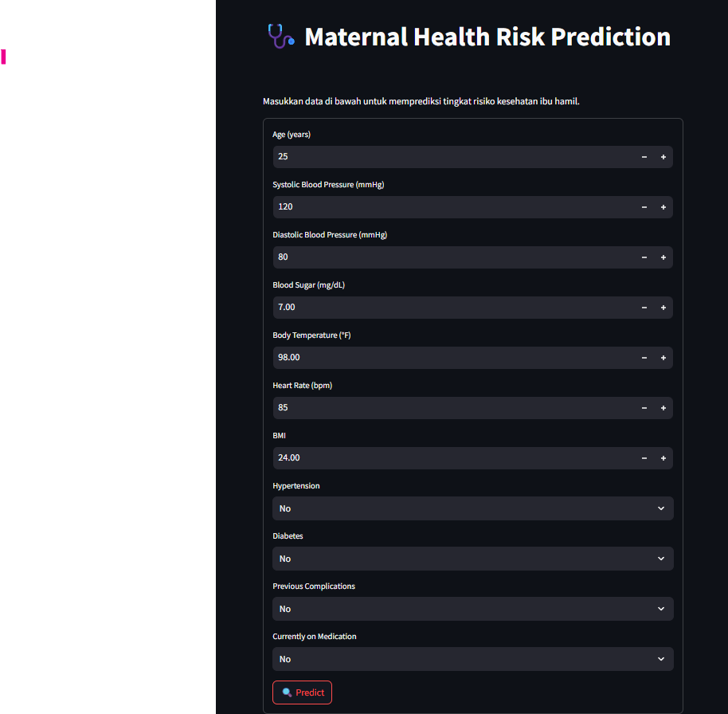
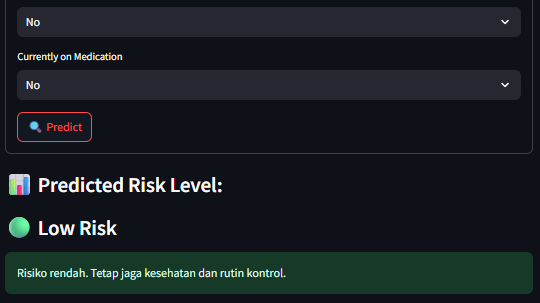

# Pregnancy Health Risk Classification App | Prediksi Risiko Kesehatan Ibu Hamil

This repository contains a machine learning model and an interactive web application built with **Streamlit** to predict maternal health risks during pregnancy. The app uses a trained TensorFlow model to determine the health risk level of a pregnant woman based on several health-related factors.

Repositori ini berisi model machine learning dan aplikasi web interaktif yang dibangun dengan **Streamlit** untuk memprediksi risiko kesehatan ibu hamil. Aplikasi ini menggunakan model TensorFlow yang telah dilatih untuk menentukan tingkat risiko kesehatan seorang ibu hamil berdasarkan beberapa faktor kesehatan.

## Model Overview | Gambaran Umum Model
The model classifies the health risk of a pregnant woman into three categories:
- Low Risk
- Mid Risk
- High Risk

Model ini mengklasifikasikan risiko kesehatan ibu hamil ke dalam tiga kategori:
- Risiko Rendah
- Risiko Sedang
- Risiko Tinggi

It uses the following input parameters:
- Age (years)
- Systolic Blood Pressure (mmHg)
- Diastolic Blood Pressure (mmHg)
- Blood Sugar (mg/dL)
- Body Temperature (°F)
- Heart Rate (bpm)
- BMI
- Hypertension (Yes/No)
- Diabetes (Yes/No)
- Previous Complications (Yes/No)
- Currently on Medication (Yes/No)

Model ini menggunakan parameter input berikut:
- Usia (tahun)
- Tekanan Darah Sistolik (mmHg)
- Tekanan Darah Diastolik (mmHg)
- Gula Darah (mg/dL)
- Suhu Tubuh (°F)
- Detak Jantung (bpm)
- BMI
- Hipertensi (Ya/Tidak)
- Diabetes (Ya/Tidak)
- Komplikasi Sebelumnya (Ya/Tidak)
- Sedang Mengonsumsi Obat (Ya/Tidak)

### How It Works | Cara Kerja
1. The user enters values for the health metrics in the web form.
2. The model predicts the risk level based on the input data.
3. The result is displayed as **Low Risk**, **Mid Risk**, or **High Risk**, along with a message to help guide the user.

1. Pengguna memasukkan nilai untuk metrik kesehatan dalam formulir web.
2. Model memprediksi tingkat risiko berdasarkan data input.
3. Hasilnya ditampilkan sebagai **Risiko Rendah**, **Risiko Sedang**, atau **Risiko Tinggi**, disertai pesan untuk membantu pengguna.

## Running the App | Menjalankan Aplikasi

1. Clone this repository or download the files.

2. Ensure all dependencies are installed.

3. In your terminal, navigate to the directory where `app.py` is located.

4. Run the following command:

```bash
streamlit run app.py
```

The app will start running, and you can access it from your browser at [http://localhost:8501](http://localhost:8501).

Aplikasi akan mulai berjalan, dan Anda dapat mengaksesnya dari browser Anda di [http://localhost:8501](http://localhost:8501).

## Dataset | Dataset

The dataset used to train the model includes health metrics of pregnant women, such as age, blood pressure, blood sugar levels, and more. This data is used to build a model that can predict health risks accurately.

Dataset yang digunakan untuk melatih model ini mencakup metrik kesehatan ibu hamil, seperti usia, tekanan darah, kadar gula darah, dan lainnya. Data ini digunakan untuk membangun model yang dapat memprediksi risiko kesehatan dengan akurat.

## Requirements | Persyaratan
To run the application locally, install the following dependencies:
- `streamlit`
- `tensorflow`
- `numpy`

Untuk menjalankan aplikasi secara lokal, instal dependensi berikut:
- `streamlit`
- `tensorflow`
- `numpy`

Use the following command to install them:

```bash
pip install streamlit tensorflow numpy
```
## Tampilan app.py Menggunakan Streamlit




