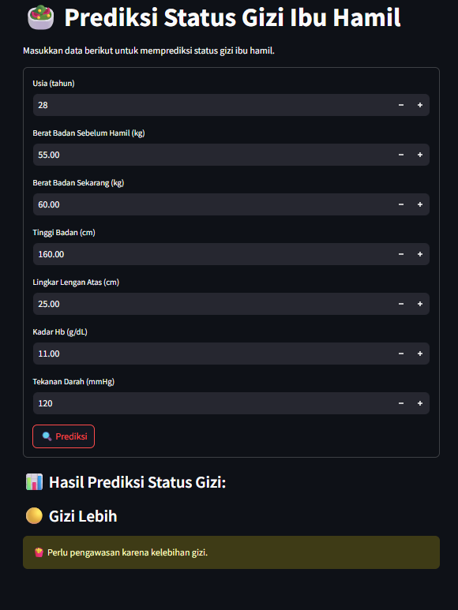

# Prediksi Status Gizi Ibu Hamil - Nutrition Status Prediction for Pregnant Women

## Bahasa Indonesia

Aplikasi ini digunakan untuk memprediksi status gizi ibu hamil berdasarkan beberapa parameter kesehatan yang dimasukkan. Cukup masukkan data yang diminta, dan aplikasi ini akan memberikan hasil prediksi apakah ibu hamil memiliki **Gizi Kurang**, **Gizi Normal**, atau **Gizi Lebih**. Prediksi ini sangat berguna untuk mengetahui apakah ibu hamil perlu perhatian khusus terkait gizi.

### Langkah-langkah Penggunaan:
1. Masukkan data yang diminta:
   - Usia
   - Berat Badan Sebelum Hamil
   - Berat Badan Sekarang
   - Tinggi Badan
   - Lingkar Lengan Atas
   - Kadar Hb
   - Tekanan Darah
2. Tekan tombol **Prediksi** untuk mendapatkan hasilnya.
3. Hasil prediksi akan muncul di bawah tombol prediksi, beserta rekomendasi terkait status gizi.

### Hasil Prediksi
Hasil akan menunjukkan status gizi ibu hamil: 
- **Gizi Kurang** 
- **Gizi Normal** 
- **Gizi Lebih** 

## English Version

This application is used to predict the nutritional status of pregnant women based on several health parameters entered. Just input the required data, and this app will provide a prediction of whether the pregnant woman has **Underweight**, **Normal Nutrition**, or **Overweight**. This prediction is useful to determine if the pregnant woman needs special attention regarding her nutrition.

### Usage Steps:
1. Input the requested data:
   - Age
   - Pre-pregnancy Weight
   - Current Weight
   - Height
   - Upper Arm Circumference
   - Hb Levels
   - Blood Pressure
2. Press the **Predict** button to get the result.
3. The prediction result will appear below the button, along with nutrition recommendations.

### Prediction Result
The result will show the nutritional status of the pregnant woman: 
- **Underweight** 
- **Normal Nutrition** 
- **Overweight** 

### Image

  

